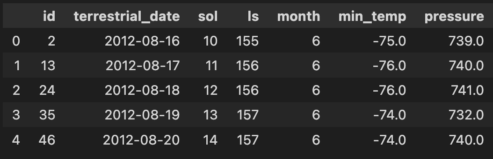

# Web-Scraping-Challenge
## Glen Dagger

### Module 12 Challenge

For this assignment, I used Splinter for automated web browsing and BeautifulSoup to parse the HTML elements in the Mars news articles page and scrape the data. I then used Pandas and MatPlotLib to analyze the data.

## Deliverable 1: Scrape Titles and Preview Text from Mars News

All coding and results are displayed in the jupyter notebook file [part_1_mars_news.ipynb](part_1_mars_news.ipynb).

 

<strong>Step 1: Visit the Website</strong>

I used automated browsing via Splinter to visit the Mars NASA news site. I inspected the page using Chrome DevTools to identify the elements I needed to scrape.

 

<strong>Step 2: Scrape the Website</strong>

After determining that each article fell under the div class 'list_text', I created a BeautifulSoup object and extracted an iterable result set of all articles.

 

<strong>Step 3: Store the Results</strong>

Once I had the set of articles, I created an empty list and iterated through the articles, extracting the title (with class labels of 'content_title') and preview (with class labels of 'article_teaser_body') from each article. Within the for loop, I stored each title and preview in its own dictionary and appended it to the empty list.

 

<strong>Step 4: Export the Data</strong>

For this optional step, I exported the data to MongoDB and separately as a JSON file.

After getting a complete list of dictionaries for each article with 'title' and 'preview' as the keys, I created a connection to PyMongo to work with MongoDBs. I created the database 'marsnews_db' with a single collection, 'articles', and inserted each dictionary form the list as a document. Finally, I displayed the items from the MongoDB collection to ensure the data was properly inserted.

Separately, I imported the json library, reset the article list so I could work on this section individually, and converted the list of dictionaries to a JSON object. I then exported the json object to the file ['mars_articles.json'](mars_articles.json), which is located in the project repository.

 

## Deliverable 2: Scrape and Analyze Mars Weather Data

All coding and results are displayed in the jupyter notebook file [part_2_mars_weather.ipynb](part_2_mars_weather.ipynb).

 

<strong>Step 1: Visit the Website</strong>

I again used automated browsing via Splinter to visit the Mars Temperature Data site. I inspected the page using Chrome DevTools to identify the elements to be scraped. 

 

<strong>Step 2: Scrape the Table</strong>

While the Pandas read_html function would have worked well to extract data from the table on the webpage directly to a dataframe, I used BeautifulSoup to further practice web scraping.

I created a BeautifulSoup object and parsed the HTML for all table header elements (tagged 'th'). I could have created a list manually, but decided to created my header_list by looping through all the headers and appending the text to my list. This would allow me to use similar code in the event new columns were added to this table or to scrape a different table entirely.

I then created a result set from the Beautiful Soup object for all data from each row (all elements with class label 'data-row').

To collect all of the scraped data, I created an empty list to store all table data and looped through the 'row_data' result set to find all row data elements (tagged 'td' in the HTML). For each row, I started a new empty list and added the contents of each cell as an element in that list. I appended the list of data for each row to my 'table_data' to store all data from the table.

 

<strong>Step 3: Store the Data</strong>

I created a Pandas dataframe called 'mars_weather_df' using the 'table_data' list and column headers from the 'header_list'. The first 5 rows of the dataframe appeared as such:

 

<strong>Step 4: Prepare Data for Analysis</strong>

I then prepared the data for analysis by examining the data type of each column and converting the 'terrestrial_date' column to datetime, the 'sol', 'ls', and 'month' columns to integers, and the 'min_temp' and 'pressure' columns to floats.

 

<strong>Step 5: Analyze the Data</strong>

I used Pandas methods and MatPlotLib to analyze and visualize the data in order to answer the following questions:

1. *How many months exist on Mars?*

I used the value_counts method on the 'month' column to determine that there are 12 Martian months represented in the dataset.

2. *How many Martian (and not Earth) days worth of data exist in the scraped dataset?*

I used the count method on the 'sol' column to determine that there are 1867 Martian days worth of data in the dataset.

3. *What are the coldest and the warmest months on Mars (at the location of Curiosity)?*

I grouped the dataframe by month and selected the 'min_temp' column to find the mean minimum temperature for each month. I then plotted the 12 resulting values on a bar chart and sorted them. This showed that month 3 has the coldest average low temperature while month 8 has the warmest.

4. *Which months have the lowest and the highest atmospheric pressure on Mars?*

I grouped the data by month to find the mean pressure for each and pltted them in a bar chart. After sorting the values, I determined that month 6 has the lowest average atmospheric pressure and month 9 has the highest.

5. *About how many terrestrial (Earth) days exist in a Martian year?*

I plotted all datafrom the 'min_temp' column on a line chart to visually estimate the result. It appeared that the difference between the peaks was roughly 750-125, or 625 days. This is slightly lower than the actual Mars year of 687 earth days which I confirmed through a Google search. This discrepancy is expected since temperature is more of a rough estimate for time of year.

 

<strong>Step 6: Save the Data</strong>

Finally, I exported the dataframe to a CSV file named ['mars_weather_df.csv'](mars_weather_df.csv) (included in main repository).